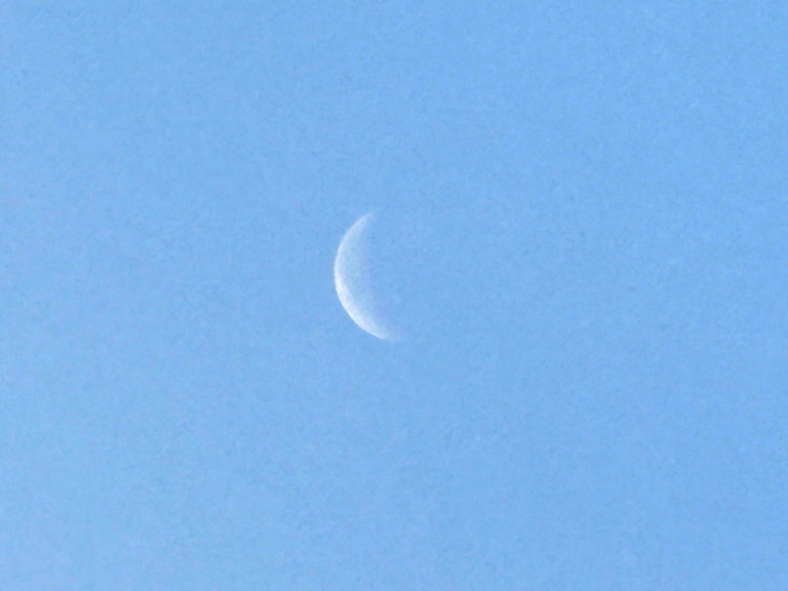
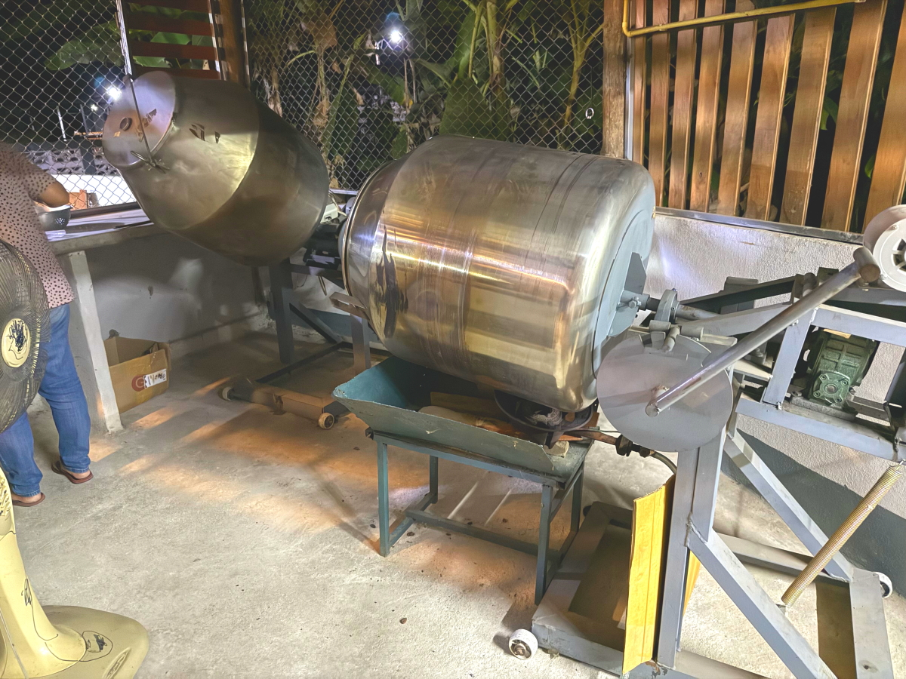

# 20250223_chiangrai

<html>
<head>

<meta charset="UTF-8">
<meta http-equiv="Content-Type" content="text/html; charset=UTF-8">
<meta http-equiv="X-UA-Compatible" content="IE=EmulateIE10" />
<meta http-equiv="X-UA-Compatible" content="IE=edge">

<meta name="viewport" content="width=device-width, initial-scale=1.0">

<!--ここから上はお決まりの定型文です-->

<!--ここからが表現の書式などを決めるcssという部分-->

<link href="https://cdnjs.cloudflare.com/ajax/libs/lightbox2/2.7.1/css/lightbox.css" rel="stylesheet">

</head>

<body>

モバイル端末をお使いの場合は、画面を横向きにすると
より見やすくご覧頂けます。

<!--ここ上は、ほぼそのまま使います！-->

<!--QRコードの挿入例-->

 アクセス用QRコード

<marquee direction="left" scrollamount="20" width="30%">(^_^)/~alis</marquee>

<!--流れ文字の挿入例-->
<h1><marquee behavior="left">!!! 2025/02/23、扇風機修理して、プールの横でアスレチック!!!</marquee></h1>

                          

<!--ここから下が、本体部分-->

<h2>夜明け画像の中にお月様が入るようになりました 朝7:22</h2>

    
<h2>朝の月はこの細さで見つけるのが大変、月齢は 24.7</h2>

    
<h2>お掃除ロボットtefalが3000バーツ引きの5000バーツで売っていたので購入</h2>

    
<h2>ハスのお花の白は次の世代にバトンタッチ</h2>

    
<h2>庭の木では、小さなお花が満開中</h2>

    
<h2>扇風機の首もたげが治らないので再修理</h2>

    
<h2>このバネがへたってます・・・耐久性が低すぎ</h2>

    
<h2>樹脂の板を共締めしてフリクション増加</h2>

    
<h2>バネの受け部にボルトのスペーサー接着してバネの反発力アップ</h2>

    
<h2>プロパンガスが無くなったので、ボンベをガス屋さんに持ち込んでガス充填</h2>

    
<h2>午後はいつものプール、入り口のお花が開き始めています</h2>

    
<h2>サルビアですね</h2>

    
<h2>プールはバンコクから来たコーチがこちらの監視員達に水泳指導中で入れず</h2>

    
<h2>プールサイドからの飛び込み指導中でした</h2>

    
<h2>外のアスレチックに行くと先客がいました</h2>

    
<h2>アスレチック周辺のお花たち</h2>

    
<h2>腹筋マシンで久々に腹筋してるところをパチリ！</h2>

    
<h2>人汗かいてからいつものショッピングモール 衣装のそろったお姉様たち・・・同一部族との主張かも</h2>

    
<h2>家電コーナーで扇風機の首の部分をチェック</h2>

    
<h2>最新モデルは改良されてました Hatariはタイの扇風機の代表メーカー Hatari回してで扇風機回しての意味になるレベル</h2>

    
<h2>帰路の途中にある市場から北東に伸びる国道</h2>

    
<h2>昨日からの工事が継続中</h2>

    
<h2>誘導ミスなのか、重機が土を避けてる横を走行 避けた土が盛り上がってるのを左のタイヤで踏みながらの走行でタイヤがまっちゃっちゃに 日本ではあり得ないのですが、タイではこのレベルは日常茶飯事</h2>

    
<h2>いつもの庭の水やりで虹つくり</h2>

    
<h2>夕陽を浴びたランのお花が撮って撮ってと視線を送ってきます</h2>

    
<h2>西の空には夕暮れ間際の雲がオレンジ色に染まってました</h2>

    
<h2>最後はむらさきグラデーション</h2>

    
<h2>義妹がカカオの自動選別機をフル稼働</h2>

    
<h2>選別品の一部でこれだけ</h2>

    
<h2>ニワトリのヒナがかなり育ったので、飼育場所を移動します</h2>

  
<h2>今日のBGMは NEW LOVE SONG 2025</h2>
<iframe width="560" height="315" src="https://www.youtube.com/embed/_l0VJ9aX0Mk?si=HEg3wZ0b2HhSU91D" title="YouTube video player" frameborder="0" allow="accelerometer; autoplay; clipboard-write; encrypted-media; gyroscope; picture-in-picture; web-share" referrerpolicy="strict-origin-when-cross-origin" allowfullscreen></iframe> 

  
<h2>まいてゃさんがYouTube上に10曲のアルバム作ってくれました</h2>

    
  
<h2>まいてゃさんのアルバム</h2> 
<iframe width="560" height="315" src="https://www.youtube.com/embed/xVTSe-eXbFs?si=ijEM5gAq9_dRK0r1" title="YouTube video player" frameborder="0" allow="accelerometer; autoplay; clipboard-write; encrypted-media; gyroscope; picture-in-picture; web-share" referrerpolicy="strict-origin-when-cross-origin" allowfullscreen></iframe>  
    
<!--  
<h2>スティーブ・ジョブズ氏の講義の内容が「笑って死ぬ」by まいてゃ さんの歌の内容と大筋で同じに聞こえます 以下に再掲しますね</h2>

    
<h3>歌の後半部分しか撮れてませんが、2月16日のイベントで公開された「笑って死ぬ」 by まいてゃ 白ドレスはダンサーの玖遠さん、黒いドレスがまいてゃさん</h3>
<iframe width="560" height="315" src="https://www.youtube.com/embed/s4ZcbxAluMM?si=Xa32xo19UCNaWv0v" title="YouTube video player" frameborder="0" allow="accelerometer; autoplay; clipboard-write; encrypted-media; gyroscope; picture-in-picture; web-share" referrerpolicy="strict-origin-when-cross-origin" allowfullscreen></iframe> 
    
    
    
    <h3>フルコーラスの「笑って死ぬ」 by まいてゃ、AI音声なので男性の声も出せます リアルは数理情報系女子でお名前はマイさんと公表されています</h3>
<h2><a href="https://torokoid.github.io/20250221_chiangrai/maitiya3.mp3" target="_blank">この文字クリックで再生します 下の再生ボタンでも同じ曲流します</a></h2>

    <audio controls>
        <source src="https://torokoid.github.io/20250221_chiangrai/maitiya3.mp3" type="audio/mpeg">
        お使いのブラウザは audio タグをサポートしていません。
    </audio>
-->

   
<h2>以上、扇風機修理してプールの横でアスレチック、最後はむらさき色の夕焼けでした。 ここまでご覧いただきありがとうございました。</h2>

     
<h2>
<a href="https://torokoid.github.io/20241126_chiangrai/" target="_blank">Back to the menu page</a>
</h2>

   

         

  

      

<!--本体はここまで-->

<!--画面に空白地帯を作って、背景が見えるようにしています-->
                                              

<!-- フッタ -->
<footer>

Copyright 2025/02/24 alis @ChiangRai

</footer>

<!--HPにさまざまなJavaScriptを呼び込むための書式-->

    
    </body>
    
</html>
